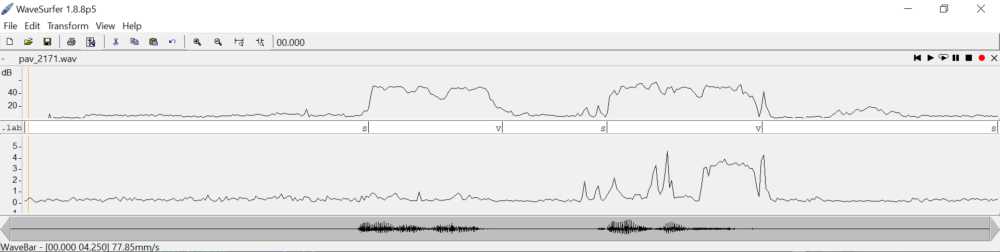
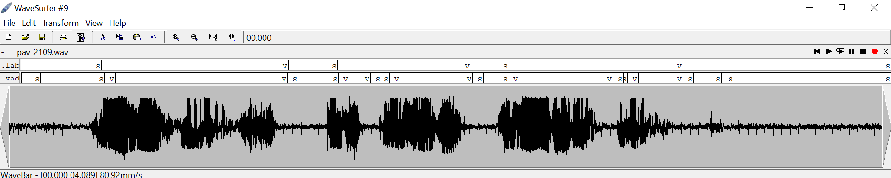
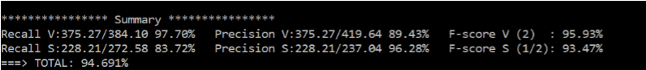

PAV - P2: detección de actividad vocal (VAD)
============================================

Esta práctica se distribuye a través del repositorio GitHub [Práctica 2](https://github.com/albino-pav/P2),
y una parte de su gestión se realizará mediante esta web de trabajo colaborativo.  Al contrario que Git,
GitHub se gestiona completamente desde un entorno gráfico bastante intuitivo. Además, está razonablemente
documentado, tanto internamente, mediante sus [Guías de GitHub](https://guides.github.com/), como
externamente, mediante infinidad de tutoriales, guías y vídeos disponibles gratuitamente en internet.


Inicialización del repositorio de la práctica.
----------------------------------------------

Para cargar los ficheros en su ordenador personal debe seguir los pasos siguientes:

*	Abra una cuenta GitHub para gestionar esta y el resto de prácticas del curso.
*	Cree un repositorio GitHub con el contenido inicial de la práctica (sólo debe hacerlo uno de los
	integrantes del grupo de laboratorio, cuya página GitHub actuará de repositorio central):
	-	Acceda la página de la [Práctica 3](https://github.com/albino-pav/P2).
	-	En la parte superior derecha encontrará el botón **`Fork`**. Apriételo y, después de unos segundos,
		se creará en su cuenta GitHub un proyecto con el mismo nombre (**P2**). Si ya tuviera uno con ese 
		nombre, se utilizará el nombre **P2-1**, y así sucesivamente.
*	Habilite al resto de miembros del grupo como *colaboradores* del proyecto; de este modo, podrán
	subir sus modificaciones al repositorio central:
	-	En la página principal del repositorio, en la pestaña **:gear:`Settings`**, escoja la opción 
		**Collaborators** y añada a su compañero de prácticas.
	-	Éste recibirá un email solicitándole confirmación. Una vez confirmado, tanto él como el
		propietario podrán gestionar el repositorio, por ejemplo: crear ramas en él o subir las
		modificaciones de su directorio local de trabajo al repositorio GitHub.
*	En la página principal del repositorio, localice el botón **Branch: master** y úselo para crear
	una rama nueva con los primeros apellidos de los integrantes del equipo de prácticas separados por
	guion (**fulano-mengano**).
*	Todos los miembros del grupo deben realizar su copia local en su ordenador personal.
	-	Copie la dirección de su copia del repositorio apretando en el botón **Clone or download**.
		Asegúrese de usar *Clone with HTTPS*.
	-	Abra una sesión de Bash en su ordenador personal y vaya al directorio **PAV**. Desde ahí, ejecute:

		```.sh
		git clone dirección-del-fork-de-la-práctica
		```

	-	Vaya al directorio de la práctica `cd P2`.
	-	Cambie a la rama **fulano-mengano** con la orden:

		```.sh
		git checkout fulano-mengano
		```

*	A partir de este momento, todos los miembros del grupo de prácticas pueden trabajar en su directorio
	local del modo habitual.
	-	También puede utilizar el repositorio remoto como repositorio central para el trabajo colaborativo
		de los distintos miembros del grupo de prácticas; o puede serle útil usarlo como copia de seguridad.
	-	Cada vez que quiera subir sus cambios locales al repositorio GitHub deberá confirmar los
		cambios en su directorio local:

		```.sh
		git add .
		git commit -m "Mensaje del commit"
		```

		y, a continuación, subirlos con la orden:

		```.sh
		git push -u origin fulano-mengano
		```

*	Al final de la práctica, la rama **fulano-mengano** del repositorio GitHub servirá para remitir la
	práctica para su evaluación utilizando el mecanismo *pull request*.
	-	Vaya a la página principal de la copia del repositorio y asegúrese de estar en la rama
		**fulano-mengano**.
	-	Pulse en el botón **New pull request**, y siga las instrucciones de GitHub.


Entrega de la práctica.
-----------------------

Responda, en este mismo documento (README.md), los ejercicios indicados a continuación. Este documento es
un fichero de texto escrito con un formato denominado _**markdown**_. La principal característica de este
formato es que, manteniendo la legibilidad cuando se visualiza con herramientas en modo texto (`more`,
`less`, editores varios, ...), permite amplias posibilidades de visualización con formato en una amplia
gama de aplicaciones; muy notablemente, **GitHub**, **Doxygen** y **Facebook** (ciertamente, :eyes:).

En GitHub. cuando existe un fichero denominado README.md en el directorio raíz de un repositorio, se
interpreta y muestra al entrar en el repositorio.

Debe redactar las respuestas a los ejercicios usando Markdown. Puede encontrar información acerca de su
sintáxis en la página web [Sintaxis de Markdown](https://daringfireball.net/projects/markdown/syntax).
También puede consultar el documento adjunto [MARKDOWN.md](MARKDOWN.md), en el que se enumeran los elementos
más relevantes para completar la redacción de esta práctica.

Recuerde realizar el *pull request* una vez completada la práctica.

Ejercicios
----------

### Etiquetado manual de los segmentos de voz y silencio

- Etiquete manualmente los segmentos de voz y silencio del fichero grabado al efecto. Inserte, a 
  continuación, una captura de `wavesurfer` en la que se vea con claridad la señal temporal, el contorno de
  potencia y la tasa de cruces por cero, junto con el etiquetado manual de los segmentos.



- A la vista de la gráfica, indique qué valores considera adecuados para las magnitudes siguientes:

	* Incremento del nivel potencia en dB, respecto al nivel correspondiente al silencio inicial, para estar
      seguros de que un segmento de señal se corresponde con voz.
	
*Podemos ver que si sube aproximadamente unos 30dB la señal pasa de ruido/silencio a voz.*

	* Duración mínima razonable de los segmentos de voz y silencio.

*Con una duración mínima de unos 100ms los segmentos de silencio conseguiremos evitar las bajadas de potencia por
culpa de las fricativas, por ejemplo.

Los segmentos de voz igual, así evitamos posibles deteciciones falsas de voz en ruidos extraños.*

	* ¿Es capaz de sacar alguna conclusión a partir de la evolución de la tasa de cruces por cero?

*No, en nuestro caso uno de los segmentos de voz tiene aproximadamente los mismos cruces por cero que cuando es silencio.
Pero en cambio el otro tiene muchisimos. Puede sernos útil si la señal tiene muchos sonidos sonoros ya que este dato aumentará
significativamente y nos podrá ayudar.*

### Desarrollo del detector de actividad vocal

- Complete el código de los ficheros de la práctica para implementar un detector de actividad vocal tan
  exacto como sea posible. Tome como objetivo la maximización de la puntuación-F `TOTAL`.

	**[Código completado en main_vad.c y en vad.c]**

- Inserte una gráfica en la que se vea con claridad la señal temporal, el etiquetado manual y la detección
  automática conseguida para el fichero grabado al efecto. 



*Podemos ver arriba la transcipción manual de la señal, justo debajo el realizado por nuestro programa y 
al final la señal temporal.*

- Explique, si existen. las discrepancias entre el etiquetado manual y la detección automática.

*Sí, como era de esperar hay discrepancias.Pero muy poco significativas, en general es un buen sistema 
de detección de voz.* 

- Evalúe los resultados sobre la base de datos `db.v4` con el script `vad_evaluation.pl` e inserte a 
  continuación las tasas de sensibilidad (*recall*) y precisión para el conjunto de la base de datos (sólo
  el resumen).


### Trabajos de ampliación

#### Cancelación del ruido en los segmentos de silencio

- Si ha desarrollado el algoritmo para la cancelación de los segmentos de silencio, inserte una gráfica en
  la que se vea con claridad la señal antes y después de la cancelación (puede que `wavesurfer` no sea la
  mejor opción para esto, ya que no es capaz de visualizar varias señales al mismo tiempo).

*Con este apartado nos reafirmamos en nuestra creencia de que es mejor tener un F-Score de V alto para evitar introducir segmentos de voz a 0.*
```c
    if (sndfile_out != 0 && (state == ST_SILENCE || state == ST_UNDEF)) {
      /* TODO: go back and write zeros in silence segments */
       sf_seek(sndfile_out, -n_read, SEEK_CUR);
       sf_write_float(sndfile_out,buffer_zeros, n_read);
    }
``` 

#### Gestión de las opciones del programa usando `docopt_c`

- Si ha usado `docopt_c` para realizar la gestión de las opciones y argumentos del programa `vad`, inserte
  una captura de pantalla en la que se vea el mensaje de ayuda del programa.


### Contribuciones adicionales y/o comentarios acerca de la práctica

- Indique a continuación si ha realizado algún tipo de aportación suplementaria (algoritmos de detección o 
  parámetros alternativos, etc.).

1. Valores de los thresholds del ruido y silencio.

*Después de varias ejecuciones del programa conseguimos depurarlo y encontrar estos valores que daban el mejor resultado posible anuestro detector.*
```c
  vad_data->power = 0;
  
  vad_data->p_alpha1 = 6; //Alpha para k1

  vad_data->fr_cont = 0; //Contador de los frames .
  
  vad_data->fr_threshold_silence = 14; //Threshold del límite de veces de silence.
  vad_data->fr_threshold_voice = 7;  //Threshold del límite de veces de voice.
```

2. Decisión del umbral de silencio.

*Como la decisición de los valores iniciales no fue muy correcta decidimos cambiar de método. Hemos hecho 
uso de un algoritmo que calcula el valor medio de la señal de ruido de las 10 primeras tramas 
de la señal. Así conseguimos una mejor aproximación del umbral. Lo hemos introducido justo al principio 
del programa en el ST_INIT*

```c
  static float power_array[10];
  Features f = compute_features(x, vad_data->frame_length);
  vad_data->last_feature = f.p; /* save feature, in case you want to show */

  switch (vad_data->state) {
  case ST_INIT:
    power_array[vad_data->fr_cont] = vad_data->last_feature;
    vad_data->fr_cont++;
    if(vad_data->fr_cont == 10){
      vad_data->state = ST_SILENCE;
      for(unsigned int i=0; i<10; i++){
        vad_data->power += pow(10, power_array[i]/10);
      }
      vad_data->power = 10*log10(vad_data->power/10);
      vad_data->k0 = vad_data->power;
      vad_data->k1 = vad_data->k0 + vad_data->p_alpha1;

      vad_data->fr_cont = 0;
      vad_data->power =0;
    }    
    break;
```
3. Cambios en los estados.

*No estabamos del todo satisfechos con los resultados obtenidos al principio una vez implementado el código así que 
cambiamos las condiciones para decidir cuando cambiar de estado*

```c
case ST_SILENCE:
    if (f.p > vad_data->k1)
      vad_data->state = ST_MAYBE_VOICE;
    break;

  case ST_VOICE:
    if (f.p < vad_data->k0)
      vad_data->state = ST_MAYBE_SILENCE;
    break;

  case ST_MAYBE_VOICE:
    vad_data->fr_cont++;
    if (vad_data->fr_cont==vad_data->fr_threshold_voice){
      vad_data->state = ST_VOICE;
      vad_data->fr_cont =0;
    }else if(f.p > vad_data->k1)
      vad_data->state = ST_MAYBE_VOICE;
    else{
      vad_data->state = ST_MAYBE_SILENCE;
      vad_data->fr_cont = 0;
    }
    break;
  case ST_MAYBE_SILENCE:
    vad_data->fr_cont++;
    if (vad_data->fr_cont==vad_data->fr_threshold_silence){
      vad_data->state = ST_SILENCE;
      vad_data->fr_cont =0;
    }else if(f.p < vad_data->k1)
      vad_data->state = ST_MAYBE_SILENCE;
    else{
      vad_data->state = ST_MAYBE_VOICE;
      vad_data->fr_cont = 0;
    }
    break;
  case ST_UNDEF:
    break;
  }

  if (vad_data->state == ST_SILENCE || vad_data->state == ST_VOICE){
    //sumar aqui y solo tener un contador.
    return vad_data->state;
  }
```

4. Printeo de los estados en el fichero .vad
*Decidimos cambiar la manera de printear los estados en el fichero .vad para que se adecuará a los estados 
que habiamos introucido en vad.c*
```c
state = vad(vad_data, buffer);
    
    if (verbose & DEBUG_VAD) vad_show_state(vad_data, stdout);
    if (state != last_state) {
      if(last_state == ST_VOICE || last_state == ST_SILENCE){
        if (t != last_t)
          fprintf(vadfile, "%.5f\t%.5f\t%s\n", last_t * frame_duration, t * frame_duration, state2str(last_state));
        last_t = t;
      }
      last_state = state;
      if(state == ST_VOICE || state == ST_SILENCE){
        if (t != last_t)
          fprintf(vadfile, "%.5f\t%.5f\t%s\n", last_t * frame_duration, t * frame_duration, state2str(last_state));
        last_t = t;
      }
    }
```

- Si lo desea, puede realizar también algún comentario acerca de la realización de la práctica que considere
  de interés de cara a su evaluación.


### Antes de entregar la práctica

Recuerde comprobar que el repositorio cuenta con los códigos correctos y en condiciones de ser 
correctamente compilados con la orden `meson bin; ninja -C bin`. El programa generado (`bin/vad`) será
el usado, sin más opciones, para realizar la evaluación *ciega* del sistema.
